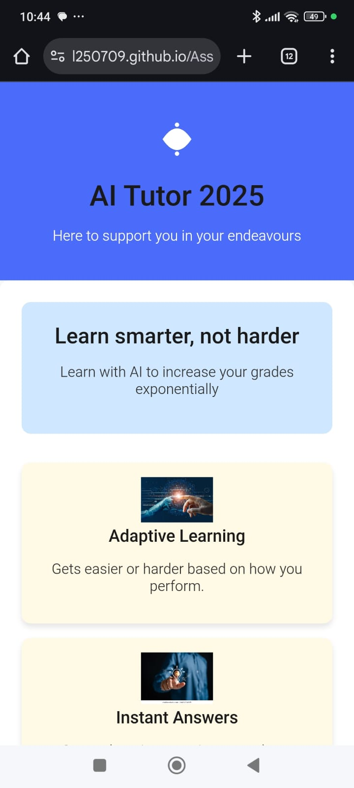
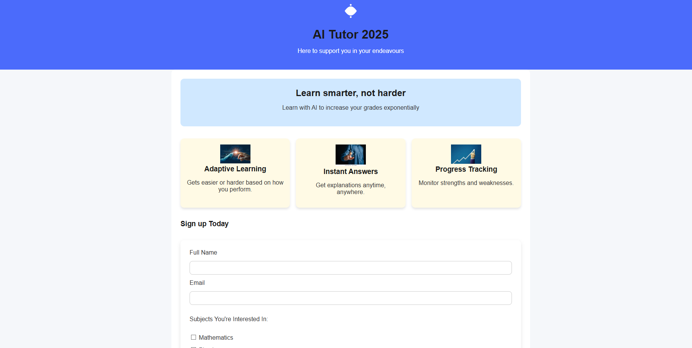
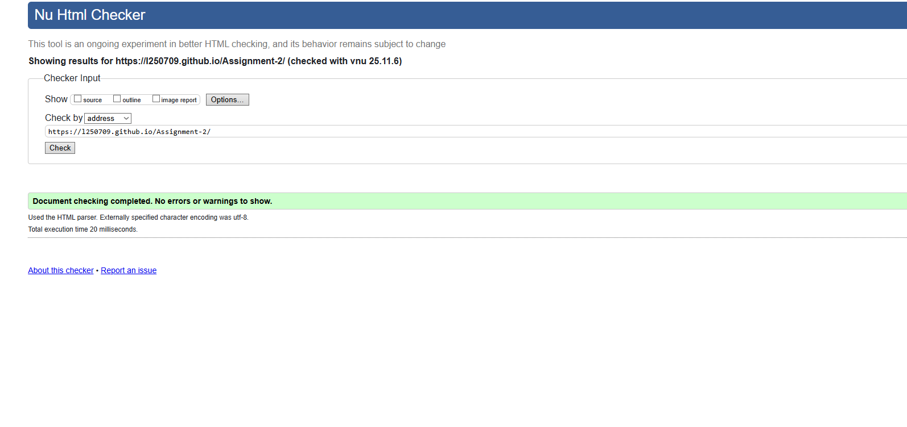
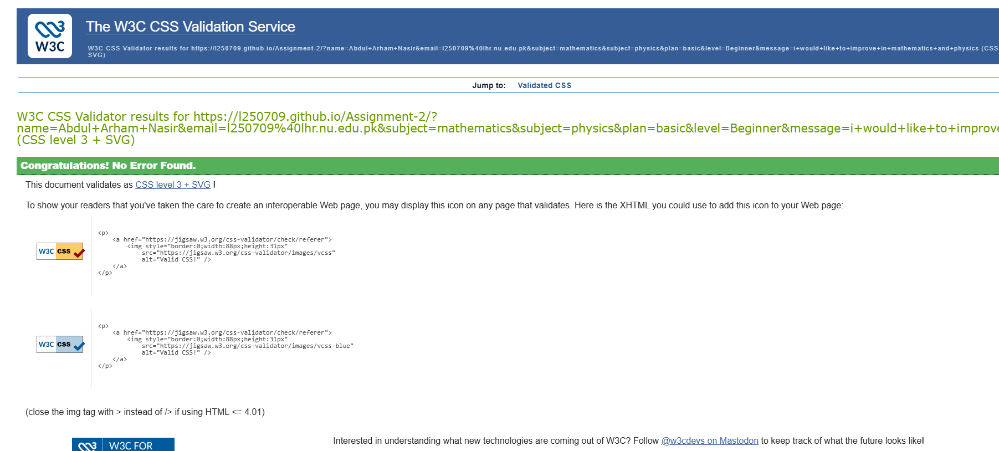

# Ai Tutor website(Seed)
Ai tutor 2025 is a website to provide with a personalized learning experience with the help of Ai.This website uses semantic Html for the website and css for the interactivity and design for the website.

## Design Rationale
i used white and blue to make the website futuristic.
CSS grid is used to keep the main part of website centered
Flexbox is used inside the features section to make the cards responsive
To increase interactivity i added hover effects on the feature cards,a glow effect on the input lines in the form and a shadow effect on the hero section when hovered.
i used svg icons to give the website identity.

## Screenshots
### Mobile View

### Desktop View

## Validator Check
### HTML Validation

### CSS Validation

